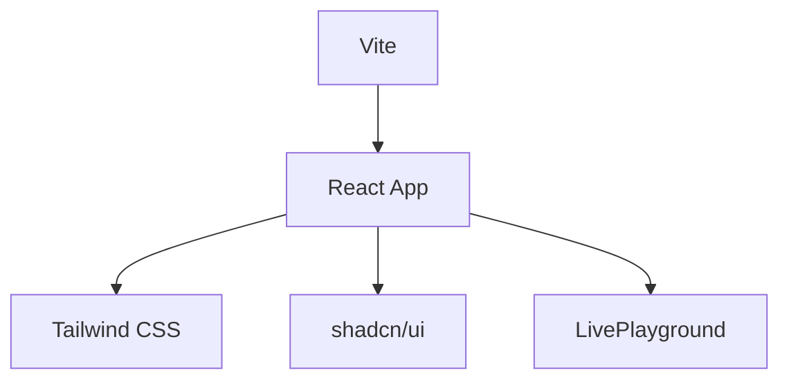

# Frontend Sandbox

This project demonstrates a Vite + React 19 workspace configured with Tailwind CSS and shadcn/ui. A live playground (based on `react-live`) lets you edit UI code and see changes instantly.

## Get Started

```bash
npm install
npm run dev    # starts the Vite dev server
```

Build the application with:

```bash
npm run build
```

## Example Usage

Import the playground component to experiment with shadcn components and Tailwind classes on the fly:

```tsx
import LivePlayground from './src/LivePlayground';

export default function App() {
  return <LivePlayground />;
}
```

## Architecture



The Vite dev server provides hot module replacement for React components. Tailwind and shadcn combine for styling, while `LivePlayground` renders editable examples using react-live.
